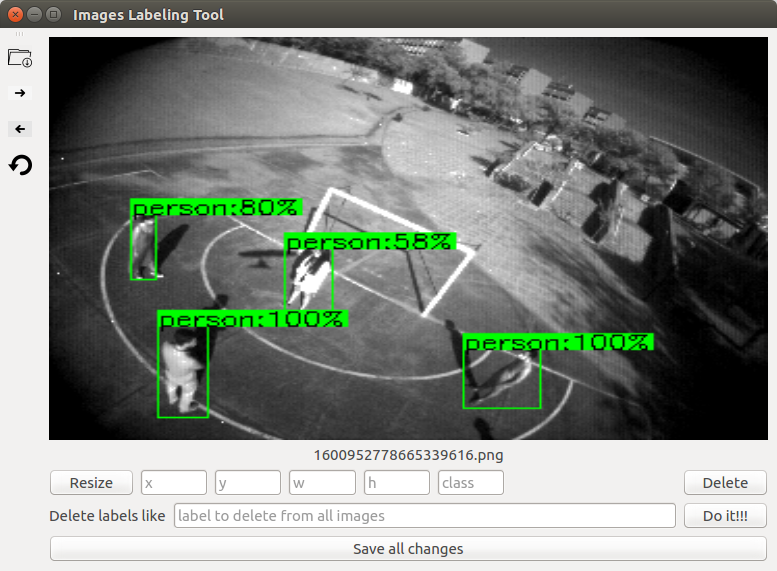

# Tool to label images using the csv generated by (https://github.com/mpcutino/yolo_event_dataset)

We can build bounding boxes or edited the ones in the csv. It generated a new modified csv according to the changes made to the existing one.

